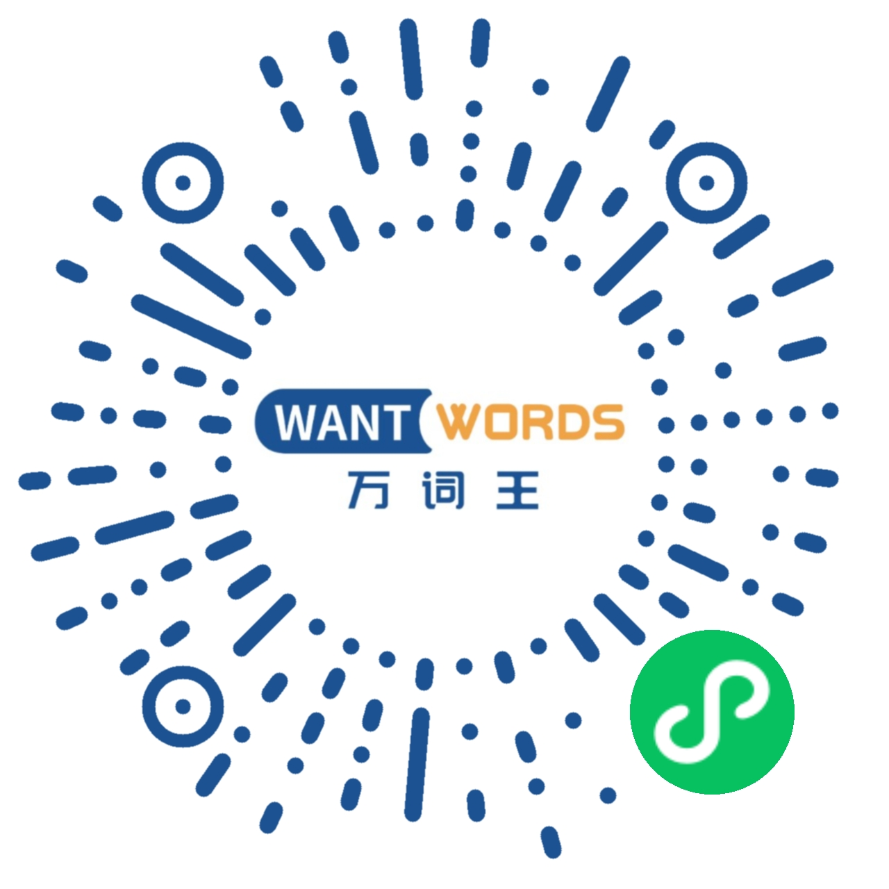
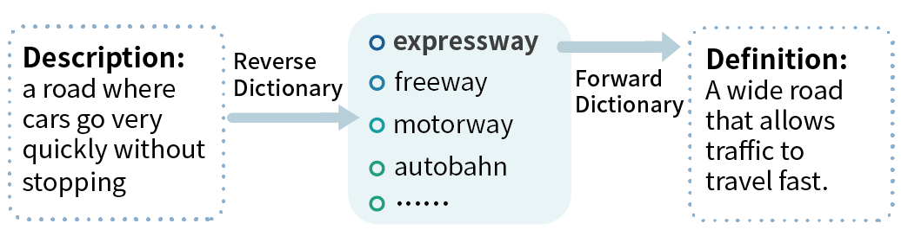
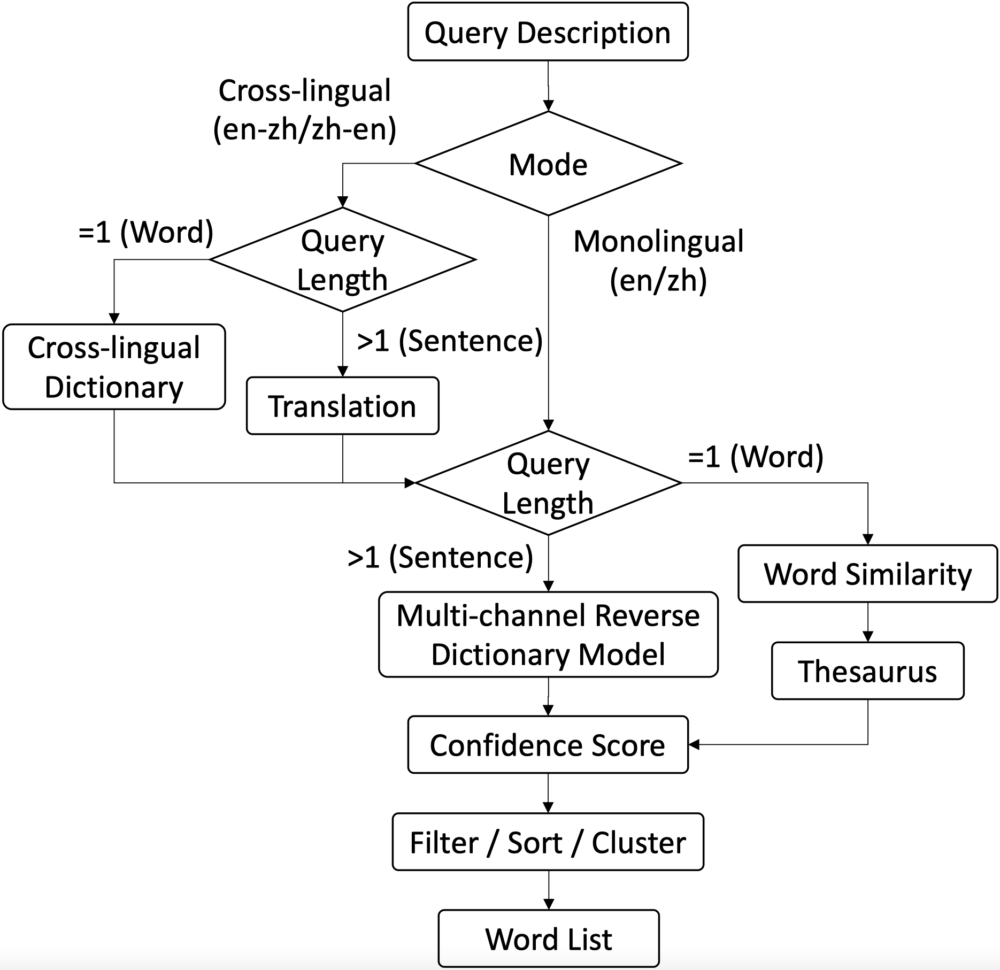
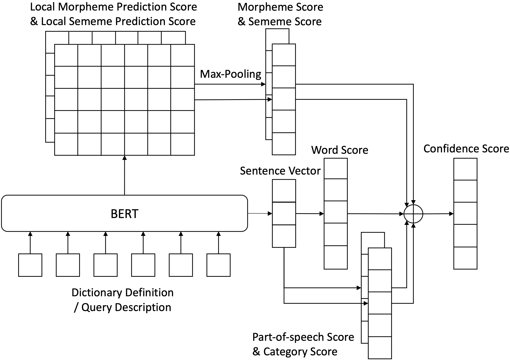

### [中](README_ZH.md)|En
<p align="center">
  <a href="https://wantwords.thunlp.org/">
  	
  </a>
</p>
<h3 align="center">An Open-source Online Reverse Dictionary [<a href="https://wantwords.net/">link</a>] </h3>

## News

The WantWords MiniProgram has been launched. Welcome to scan the following QR code to try it!
<div align=center>

</div>


## What Is a Reverse Dictionary?
Opposite to a regular (forward) dictionary that provides definitions for query words, a reverse dictionary returns words semantically matching the query descriptions.

<div align=center>

</div>

## What Can a Reverse Dictionary Do?
* Solve the *tip-of-the-tongue problem*, the phenomenon of failing to retrieve a word from memory
* Help new language learners
* Help word selection (or word dictionary) anomia patients, people who can recognize and describe an object but fail to name it due to neurological disorder

## Our System
### Workflow

<div align=center>

</div>

### Core Model

The core model of WantWords is based on our proposed **Multi-channel Reverse Dictionary Model** [[paper](https://ojs.aaai.org/index.php/AAAI/article/view/5365/5221)] [[code](https://github.com/thunlp/MultiRD)], as illustrate in the following figure.

<div align=center>

</div>


### Pre-trained Models and Data

You can [download](https://cloud.tsinghua.edu.cn/d/811dcb428ed24480bc60/) and decompress the pre-trained models and data to `BASE_PATH/website_RD/` to reimplement the system.

### Key Requirements

* Django==2.2.5
* django-cors-headers==3.5.0
* numpy==1.17.2
* pytorch-transformers==1.2.0
* requests==2.22.0
* scikit-learn==0.22.1
* scipy==1.4.1
* thulac==0.2.0
* torch==1.2.0
* urllib3==1.25.6
* uWSGI==2.0.18
* uwsgitop==0.11

## Cite

If the code or data help you, please cite the following two papers.

```
@inproceedings{qi2020wantwords,
  title={WantWords: An Open-source Online Reverse Dictionary System},
  author={Qi, Fanchao and Zhang, Lei and Yang, Yanhui and Liu, Zhiyuan and Sun, Maosong},
  booktitle={Proceedings of the 2020 Conference on Empirical Methods in Natural Language Processing: System Demonstrations},
  pages={175--181},
  year={2020}
}

@inproceedings{zhang2020multi,
  title={Multi-channel reverse dictionary model},
  author={Zhang, Lei and Qi, Fanchao and Liu, Zhiyuan and Wang, Yasheng and Liu, Qun and Sun, Maosong},
  booktitle={Proceedings of the AAAI Conference on Artificial Intelligence},
  pages={312--319},
  year={2020}
}
```


