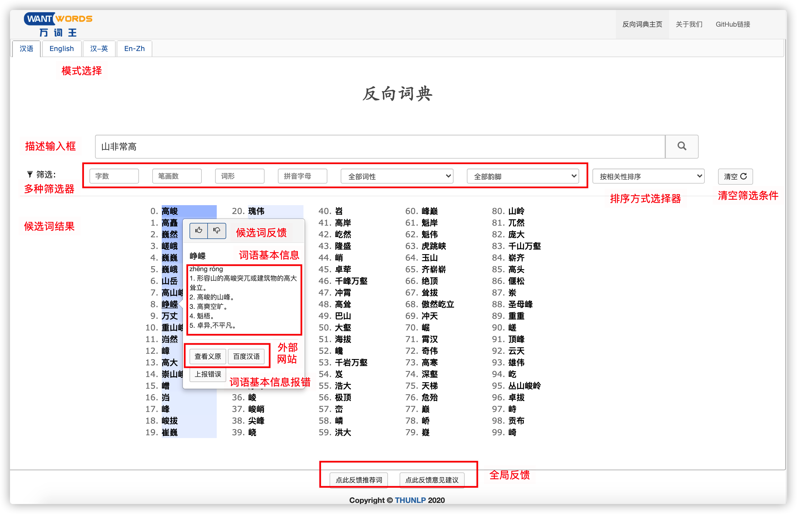
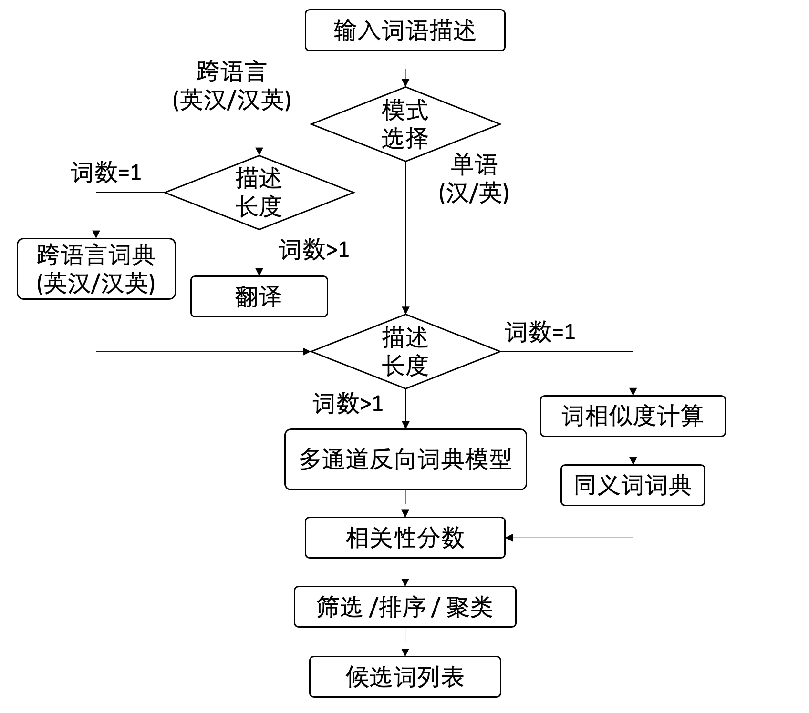
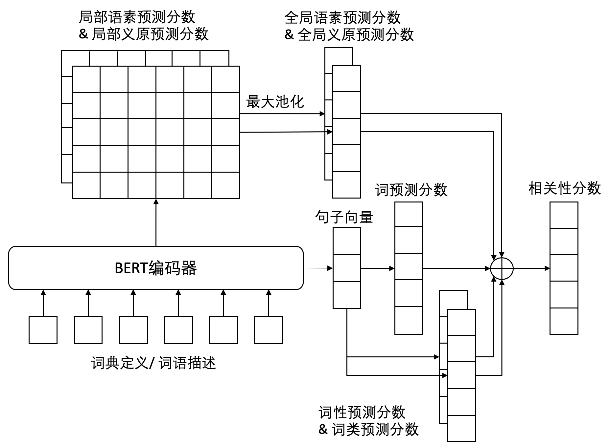

### 中|[En](README.md)
<p align="center">
  <a href="https://wantwords.thunlp.org/">
  	
  </a>
</p>
<h3 align="center">首个支持中文及跨语言查询的开源在线反向词典 [<a href="https://wantwords.net/">点击访问</a>] </h3>

## 新闻

WantWords小程序已上线，欢迎扫码体验！
<div align=center>

</div>


## 什么是反向词典?

普通的词典告诉你某个词语的定义，而反向词典恰好相反，可以告诉你哪些词语符合你输入描述的意思。下图为WantWords在线反向词典的页面截图，其中演示了反向查词的一个示例，输入“山非常高”，系统将返回一系列模型认为表达“山非常高”意思的词语，例如“高峻”、“巍峨”等。

<div align=center>

</div>

## 反向词典可以用来做什么?
* 解决“舌尖现象”（*tip-of-the-tongue*，又称话到嘴边说不出来），即暂时性忘词的问题
* 帮助语言学习者学习、巩固词汇
* 改善选词性失语者患者的生活质量，该病的症状是可以识别并描述一个物体，但是无法记起该物体的名字

## 系统架构
### 工作流

<div align=center>

</div>

### 核心模型

WantWords的核心模型为我们此前发表在AAAI-20上的一篇论文提出的多通道反向词典模型：**Multi-channel Reverse Dictionary Model** [[论文](https://ojs.aaai.org/index.php/AAAI/article/view/5365/5221)] [[代码](https://github.com/thunlp/MultiRD)]，其模型架构如下所示。

<div align=center>

</div>


### 模型和数据

可从[此处](https://cloud.tsinghua.edu.cn/d/811dcb428ed24480bc60/)下载并解压模型和数据到 `BASE_PATH/website_RD/` 以构建此系统。

### 关键依赖

* Django==2.2.5
* django-cors-headers==3.5.0
* numpy==1.17.2
* pytorch-transformers==1.2.0
* requests==2.22.0
* scikit-learn==0.22.1
* scipy==1.4.1
* thulac==0.2.0
* torch==1.2.0
* urllib3==1.25.6
* uWSGI==2.0.18
* uwsgitop==0.11

## 引用

如果本项目的代码或者数据帮到你，请引用以下两篇论文：

```
@inproceedings{qi2020wantwords,
  title={WantWords: An Open-source Online Reverse Dictionary System},
  author={Qi, Fanchao and Zhang, Lei and Yang, Yanhui and Liu, Zhiyuan and Sun, Maosong},
  booktitle={Proceedings of the 2020 Conference on Empirical Methods in Natural Language Processing: System Demonstrations},
  pages={175--181},
  year={2020}
}

@inproceedings{zhang2020multi,
  title={Multi-channel reverse dictionary model},
  author={Zhang, Lei and Qi, Fanchao and Liu, Zhiyuan and Wang, Yasheng and Liu, Qun and Sun, Maosong},
  booktitle={Proceedings of the AAAI Conference on Artificial Intelligence},
  pages={312--319},
  year={2020}
}
```


